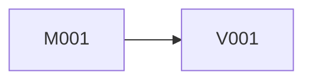

# MDD 索引模板

`Design/Docs/MDD/索引.md` 是当前版本完整技术地图。正文用于人工审查，末尾 JSON 用于机械验证；两者必须由同一临时设计合同生成。

# MDD 索引

## 1. 设计基线

- 产品与当前版本：
- 策划案依据：
- GDD：
- Unity/July/Luban 固定版本证据：
- 稳定宿主入口、程序集、namespace、注册、UI、资源与作者源约定：
- 本轮明确排除：

## 2. GDD 范围覆盖

| GDD 责任/流程 | Module | View | 动作 ID | 可见结果 | 覆盖结论 |
| --- | --- | --- | --- | --- | --- |

每项当前版本责任都必须有实现和表现去向。不能把 Editor 验证、生成或发布任务列为业务能力。

## 3. 业务事实所有权

| 业务事实 | 唯一权威来源 | 写入者 | 读取者 | 派生方式/更新时机 | 禁止副本 |
| --- | --- | --- | --- | --- | --- |

WindowData 是展示快照，不是业务权威。框架时间等稳定事实直接使用；可计算值不重复配置。

## 4. 全局动作合同

| 动作 ID | 玩家意图 | 类型 | 唯一 owner | 规范 signature | 前置 | 成功 | 允许失败 | 导航 owner/目标 | GDD |
| --- | --- | --- | --- | --- | --- | --- | --- | --- | --- |

每行必须逐字对应结构化合同中的一个 action。Module/View 只引用，不创建第二套签名。

## 5. Module 与 View 清单

### Module

| ID | 稳定业务能力 | 责任 | 拥有事实 | 动作 | 提供符号 | MDD |
| --- | --- | --- | --- | --- | --- | --- |

### View

| ID | 视觉功能 | 形态 | 玩家可见责任 | 动作 | 提供符号 | MDD |
| --- | --- | --- | --- | --- | --- | --- |

清单必须覆盖合同全部 artifacts，且路径逐字一致。

## 6. 产品符号唯一提供表

| Symbol ID | 类别 | 唯一 provider | 准确位置 | 消费 MDD |
| --- | --- | --- | --- | --- |

列出所有跨 MDD 使用的 C# 类型/成员/Event、Luban 类型、Window/Data、Prefab/资源合同和注册项。

## 7. 全产物实施依赖图

### 依赖边

| 消费 MDD | provider | symbol / 动作 ID | dependencyType | 原因 |
| --- | --- | --- | --- | --- |

### 无环图



箭头为 provider → consumer。图必须包含全部 Module 与 View，并与结构化合同一致。

## 8. 精确实施顺序

| 序号 | MDD | dependsOn | 此前可用符号/动作 | 本 MDD 提供 | 独立编译与验收 |
| --- | --- | --- | --- | --- | --- |

每行一份 MDD，顺序逐字对应 `implementationOrder`。它不授权自动实施下一项。

## 9. 单份 MDD 闭包证明

为每份 MDD 分别列出：

- 稳定宿主/固定包输入；
- earlier MDD 输入；
- 自有白名单产物；
- 使用动作；
- 所有消费 symbol 及 provider；
- Unity/Luban/注册/Prefab 闭包；
- 不依赖后续 MDD 的独立验收结论。

## 10. 完整性结论

明确写出语义审查结果和最近一次 `full` 验证结果。勾选框不能替代脚本退出码。

## 11. 结构化设计合同

嵌入 `.july-design-contract.json` 的完整、未改写 JSON：

````text
```july-design-contract
{完整 JSON}
```
````
