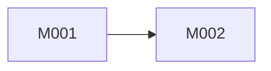

# 索引模板

`Design/Docs/MDD/索引.md` 是当前版本唯一技术总览。它不是状态文件，不记录人工确认阶段，也不是批量执行清单。

使用以下结构，并删除不适用的提示文字。

## 1. 当前版本技术范围

- 对应 GDD 章节：
- 包含能力：
- 包含 View：
- 明确排除：
- 用户明确推迟的非结构性内容：

## 2. 稳定宿主与框架约束

记录当前工程实际证据，不记录其他产品：

| 约束 | 当前工程证据 | 对设计的影响 |
| --- | --- | --- |
| 业务源码根目录/程序集 |  |  |
| root namespace |  |  |
| 启动与 ArchContext 组合 |  |  |
| Store/System 注册 |  |  |
| Procedure 运行方式 |  |  |
| UI provider 与 Window 配置 |  |  |
| 事件机制 |  |  |
| Luban 作者源与生成入口 |  |  |
| 场景/Prefab/资源约定 |  |  |
| 固定 July/Luban 版本 |  |  |

重新生成时说明哪些目录属于稳定宿主；不要从旧业务类推导新设计。

## 3. 全局业务事实所有权

本表必须先于产品类型和文件设计完成。

| 业务事实 | 权威来源 | 写入者 | 读取者 | 派生方式/更新时机 | 禁止副本 |
| --- | --- | --- | --- | --- | --- |
|  | Luban / Store / July或Unity / 派生 |  |  |  |  |

检查：

- 同一事实只有一行权威来源；
- 派生值不进入 Luban 或 Store；
- WindowData 只保存当前展示快照；
- 框架已有事实不建立项目平行结构。

## 4. 完整玩家流程覆盖

| GDD 流程 | 玩家触发 | 发起模块 | 参与模块 | 参与 View | 成功/允许失败 |
| --- | --- | --- | --- | --- | --- |
|  |  |  |  |  |  |

完整流程不创建独立运行时层；详细编排写入发起模块 MDD。

## 5. 模块清单

| 编号 | 模块 | 稳定能力 | 拥有事实 | 公开动作 | 依赖 | MDD |
| --- | --- | --- | --- | --- | --- | --- |
| M001 |  |  |  |  |  | `Modules/M001_<能力>.md` |

模块按业务能力划分。没有手写代码的配置型模块也必须有稳定作者事实、明确消费者和独立维护价值。

## 6. 模块依赖图

先用边表记录精确原因：

| 上游模块 | 依赖模块 | 使用的公开事实/动作 | 原因 |
| --- | --- | --- | --- |
|  |  |  |  |

再给出最小 Mermaid 图：

必须无环。若 Mermaid 图出现环，停止定稿并重新分配事实或操作所有权。

## 7. JulyArch 角色总览

| 模块 | 类型/生成类型 | 角色 | 责任 | 选择依据 | 注册/创建位置 |
| --- | --- | --- | --- | --- | --- |
|  |  | Store/System/Procedure/普通类型/Luban生成类型 |  |  |  |

这里只做导航；数据结构、接口和伪代码在模块 MDD 中完整展开。

## 8. View 清单

| 编号 | View | 玩家可见责任 | 形态 | 数据来源 | 交互入口 | MDD |
| --- | --- | --- | --- | --- | --- | --- |
| V001 |  | Window/GameView/组合 |  |  |  | `Views/V001_<视觉功能>.md` |

当前版本每个屏幕和视觉功能都必须有归属。不要把 UI 与 2D 放入不同文档目录；形态仅作为设计信息。

## 9. 配置总览

| 所属模块 | 作者源/表 | 业务事实 | 直接消费者 | 生成类型 | 完整 schema 所在 MDD |
| --- | --- | --- | --- | --- | --- |
|  |  |  |  |  |  |

此表不得包含派生计数或为了代码方便而复制的常量。

## 10. 推荐实施波次

| 波次 | MDD | 依赖依据 | 可独立验收结果 |
| --- | --- | --- | --- |
| 1 |  |  |  |

波次只表达推荐顺序。一次实施仍然只接受用户明确指定的一份 MDD，不能整波自动执行。

## 11. 完整性检查

- [ ] 当前版本全部 GDD 责任已覆盖；
- [ ] 全局事实均有唯一权威来源；
- [ ] 模块依赖无环；
- [ ] 每条完整玩家流程有发起模块；
- [ ] 所有模块 MDD 已列出；
- [ ] 所有 View MDD 已列出；
- [ ] 配置 schema 有明确所属模块；
- [ ] 没有持久化设计、测试代码计划、独立联通层或总协调层；
- [ ] 每份 MDD 都有精确文件白名单与验收路径。
