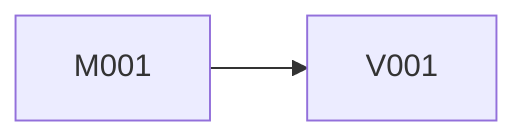

# 索引模板

`Design/Docs/MDD/索引.md` 是当前版本唯一技术总览。它不是状态文件，不记录人工确认阶段，也不是批量执行清单。

使用以下结构。所有表必须填写当前产品的真实内容，不保留模板示例或“实施时决定”。

## 1. 当前版本技术范围

- 对应 GDD 章节：
- 包含能力：
- 包含 View：
- 明确排除：
- 用户明确推迟的非结构性内容：

## 2. 稳定宿主与框架约束

只记录当前工程实际证据：

| 约束 | 当前工程证据 | 对设计的影响 |
| --- | --- | --- |
| 业务源码根目录/程序集 |  |  |
| root namespace |  |  |
| 启动与 ArchContext 组合 |  |  |
| Store/System 注册 |  |  |
| Procedure 运行方式 |  |  |
| UI provider 与 Window 配置 |  |  |
| 事件机制 |  |  |
| Luban 作者源与生成入口 |  |  |
| 场景/Prefab/资源约定 |  |  |
| 固定 July/Luban 版本 |  |  |

重新生成时说明哪些目录属于稳定宿主；不要从旧业务类推导新设计。持久化组合不是本轮设计证据，不记录 Store 的保存注册或存读入口。

## 3. 全局业务事实所有权

本表必须先于产品类型和文件设计完成。

| 业务事实 | 权威来源 | 写入者 | 读取者 | 派生方式/更新时机 | 禁止副本 |
| --- | --- | --- | --- | --- | --- |
|  | Luban / Store / July或Unity / 派生 |  |  |  |  |

检查：

- 同一事实只有一行权威来源；
- 派生值不进入 Luban 或 Store；
- WindowData 只保存当前展示快照；
- 框架已有事实不建立项目平行结构；
- Store 只描述当前运行期数据，不声明跨启动恢复。

## 4. 全局玩家动作合同

先把完整流程拆成原子动作，再填写本表。每个动作只有一个权威合同。

| 动作 ID | 玩家意图 | 类型 | 唯一所有者 | 规范签名/调用 | 前置 | 成功/允许失败 | 导航所有者与目标 | 对应 GDD |
| --- | --- | --- | --- | --- | --- | --- | --- | --- |
| A001 |  | 业务操作 / 纯导航 / View本地表现 | 具体模块、View 或 UISystem |  |  |  |  |  |

检查：

- 同一动作不能在不同 MDD 中出现不同参数或返回；
- 打开选择页和确认选择提交业务是不同原子动作；
- 纯导航不伪装成业务 System 操作；
- 依赖业务成功的导航只属于该业务动作的 System/Procedure；
- 模块流程、公共接口和 View 交互全部引用动作 ID。

## 5. 完整玩家流程覆盖

| GDD 流程 | 原子动作 ID 顺序 | 发起能力 | 参与模块 | 参与 View | 最终结果 |
| --- | --- | --- | --- | --- | --- |
|  | A001 → A002 |  |  |  |  |

完整流程不创建独立运行时层；详细编排写入发起能力的模块 MDD。这里的动作顺序必须与各 MDD 逐项一致。

## 6. MDD 清单

### 6.1 模块

| 编号 | 模块 | 稳定能力 | 拥有事实 | 提供动作 ID | 提供产品符号 | MDD |
| --- | --- | --- | --- | --- | --- | --- |
| M001 |  |  |  |  |  | `Modules/M001_<能力>.md` |

模块按业务能力划分。编号在全产物拓扑排序完成后分配；低编号模块不得依赖更高编号模块。

### 6.2 View

| 编号 | View | 玩家可见责任 | 形态 | 使用动作 ID | 提供产品符号 | MDD |
| --- | --- | --- | --- | --- | --- | --- |
| V001 |  | Window / GameView / 组合 |  |  |  | `Views/V001_<视觉功能>.md` |

View 编号同样在拓扑排序后分配；低编号 View 不得依赖更高编号 View。UI 与 2D 不建立不同文档目录。

## 7. 产品符号唯一提供表

列出所有跨 MDD 使用的产品符号与产物：

| 产品符号/产物 | 类别 | 唯一提供 MDD | 定义文件/作者源 | 可用时点 | 消费 MDD |
| --- | --- | --- | --- | --- | --- |
|  | C#类型/成员/Event/Luban生成类型/Window/Data/Prefab/资源/注册项 |  |  | 提供 MDD 完成后 |  |

要求：

- 一个符号只有一个提供 MDD；
- Luban Bean/枚举属于实际定义它的 MDD，不以“复用后续 MDD”描述；
- 共享注册文件可多次修改，但每个注册项仍有唯一提供 MDD；
- 消费 MDD 必须排在提供 MDD 之后。

## 8. 全产物实施依赖图

依赖图必须包含全部 Module MDD 和 View MDD，以及它们对 Luban 生成类型、注册项、Prefab 和资源的依赖。

### 8.1 依赖边

| 消费 MDD | 提供 MDD | 依赖符号/文件/动作 ID | 类型 | 原因 |
| --- | --- | --- | --- | --- |
|  |  |  | 编译 / Luban作者 / 注册 / Prefab制作 / 运行时合同 |  |

稳定宿主与固定 July/Luban API 不作为 MDD 节点，但依据必须记录在第 2 节。

### 8.2 无环图

图中箭头使用“提供者 → 消费者”：

必须无环。不得默认“全部模块 → 全部 View”；Module 与 View 可以交错。出现环时重新分配动作、导航、符号或 MDD 边界，不创建占位接口、事件、字符串路由或协调器掩盖。

## 9. JulyArch 角色总览

| 模块 | 类型/生成类型 | 角色 | 责任 | 选择依据 | 注册/创建位置 |
| --- | --- | --- | --- | --- | --- |
|  |  | Store/System/Procedure/普通类型/Luban生成类型 |  |  |  |

这里只做导航；数据结构、接口和伪代码在模块 MDD 中完整展开。Store 不注册到持久化系统。

## 10. 配置总览

| 所属 MDD | 作者源/表 | 提供生成符号 | 业务事实 | 直接消费者 | 最早可实施序号 | 完整 schema |
| --- | --- | --- | --- | --- | --- | --- |
|  |  |  |  |  |  |  |

不得包含派生计数、为消费者方便复制的值或后续 MDD 才定义的 Bean/枚举。

## 11. 精确实施顺序

这是全产物依赖图的一个有效拓扑序。每行只列一份 MDD。

| 序号 | MDD | 精确前置 MDD | 此前可用的产品符号 | 本 MDD 新增符号 | 独立编译与验收结果 |
| --- | --- | --- | --- | --- | --- |
| 1 |  | 无 | 仅稳定宿主与固定包 API |  |  |

约束：

- 第 1 项必须无产品 MDD 前置依赖；
- 每个前置 MDD 都必须出现在更早行；
- 当前 MDD 不能引用任何后续行的类型、成员、生成类型、View、Data、Event、Prefab 脚本或注册项；
- 当前 MDD 完成后必须可以 Unity 编译并完成自身验收；
- 编号是身份，只有本表是实施顺序；
- 一次仍只实施用户明确指定的一份 MDD，不自动继续下一项。

## 12. 单份 MDD 闭包证明

逐份记录，不用一句“依赖已满足”代替：

### <MDD ID>

- 稳定宿主/固定包输入：
- 更早 MDD 输入：
- 自有白名单产物：
- 使用的动作 ID：
- 所有引用符号及提供者：
- 编译闭包结论：
- 不依赖后续 MDD 的验收结论：

若任一引用无法归入稳定宿主、更早 MDD或自有产物，设计无效。

## 13. 完整性检查

- [ ] 当前版本全部 GDD 责任已覆盖；
- [ ] 全局事实均有唯一权威来源；
- [ ] 每个原子玩家动作有唯一 ID、所有者、规范签名与导航所有者；
- [ ] 每个跨 MDD 产品符号有唯一提供者；
- [ ] 全部 Module/View MDD 位于同一依赖图；
- [ ] 依赖图无环，实施顺序是有效拓扑序；
- [ ] 每份 MDD 只依赖稳定宿主、自有或更早产物；
- [ ] 每份 MDD 实施后可以独立编译并完成自身验收；
- [ ] 所有模块 MDD 与 View MDD 已列出；
- [ ] 配置 schema 有明确所属 MDD，生成类型先于消费者；
- [ ] 没有持久化注册、保存/读取、跨启动恢复或保存失败合同；
- [ ] 没有目标项目测试代码计划、独立联通层、总协调层或设计外占位；
- [ ] 每份 MDD 都有精确文件白名单与验收路径。
